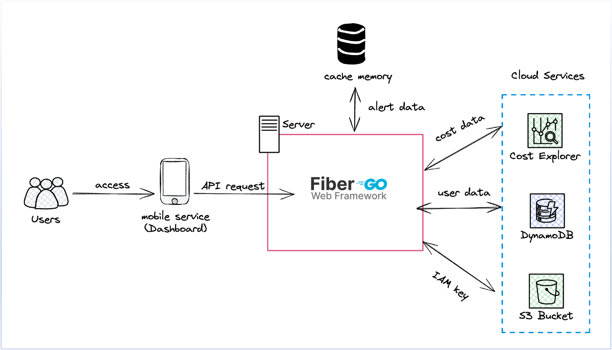

<!-- Improved compatibility of back to top link: See: https://github.com/othneildrew/Best-README-Template/pull/73 -->
<a name="readme-top"></a>
[![Contributors][contributors-shield]][contributors-url] [![Forks][forks-shield]][forks-url] [![Stargazers][stars-shield]][stars-url] [![Issues][issues-shield]][issues-url] [![Pull Request][pr-shield]][pr-url] [![MIT License][license-shield]][license-url]


<!-- PROJECT LOGO -->
<br />
<div align="center">
  <a href="https://github.com/Eeap/Mobile-Billing-Dashboard">
    <h3 align="center">Mobile Billing Dashboard with AWS</h3>
  </a>


  <p align="center">
    <a href="https://github.com/Eeap/Mobile-Billing-Dashboard/blob/main/README.md">한국어</a>
    <br />
    <a href="https://github.com/Eeap/Mobile-Billing-Dashboard/issues">Report Issues</a>
    ·
    <a href="https://github.com/Eeap/Mobile-Billing-Dashboard/pulls">Pull Requests</a>
  </p>
</div>


<!-- TABLE OF CONTENTS -->
<details>
  <summary>Table of Contents</summary>
  <ol>
    <li>
      <a href="#mag-about-the-project">About The Project</a>
      <ul>
        <li><a href="#card_file_box-built-with">Built With</a></li>
      </ul>
    </li>
    <li>
      <a href="#rocket-getting-started">Getting Started</a>
      <ul>
        <li><a href="#zap-prerequisites">Prerequisites</a></li>
      </ul>
    </li>
    <li><a href="#globe_with_meridians-architecture">Architecture</a></li>
    <li><a href="#memo-rest-apii">REST API</a></li>
    <li><a href="#fire-contributing">Contributing</a></li>
    <li><a href="#closed_lock_with_key-license">License</a></li>
    <li><a href="#speech_balloon-contact">Contact</a></li>
  </ol>
</details>


<!-- ABOUT THE PROJECT -->
## :mag: About The Project
해당 프로젝트는 웹으로 존재하는 AWS Billing Dashboard를 모바일으로도 이용 요금 현황을 파악할 수 있게 만들어진 프로젝트입니다. 리소스 별로 비용 차트를 확인할 수 있고 타겟 비용에 대한 알람을 설정할 수 있습니다.

### Main Page & Key Settings


### Alert Page & Alert Settings

<p align="right">(<a href="#readme-top">back to top</a>)</p>


### :card_file_box: Built With
#### :bulb: Language
[![Go][Go]][Go-url] [![Dart][Dart]][Dart-url] [![Flutter][Flutter]][Flutter-url]
#### :bulb: Infrastructure
[![aws][aws]][aws-url]
#### :bulb: Environment (CI/CD, Package tools...)
[![Github-actions][Github-actions]][Github-actions-url]

<p align="right">(<a href="#readme-top">back to top</a>)</p>


<!-- GETTING STARTED -->
## :rocket: Getting Started

### :zap: Prerequisites
Download and install packages and associated dependencies via `go get`
* go
  ```sh
  go get .
  ```

Download and install packages and associated dependencies via `flutter pub get`
* dart flutter
  ```sh
  flutter pub get
  ```

<p align="right">(<a href="#readme-top">back to top</a>)</p>


## :globe_with_meridians: Architecture
### :triangular_flag_on_post: Overall Service Configuration Architecture


### :triangular_flag_on_post: Development Environment Architecture


<p align="right">(<a href="#readme-top">back to top</a>)</p>

## :memo: REST API

### ❗️Get `/api/v1/aws-resource`
#### Request
- Description - aws resource cost list 요청
```bash
curl -i -H 'Accept: application/json' http://localhost:8000/api/v1/aws-resource?email="test@gmail.com"&region="us-east-1"&day=7

```
#### Response
- Description - aws resource cost list 반환
```json
{
  "statusCode": 200,
  "data": {
    "resources": [
      {
          "key":       "Amazon Simple Storage Service",
          "amount":    "2.8",
          "timeEnd":   "2023-11-01",
          "timeStart": "2023-11-02",
      },
    ],
    "totalResults": 1
  }
}
```

### ❗️Get `/api/v1/alert-messages`
#### Request
- Description - alert message list 요청
```bash
curl -i -H 'Accept: application/json' http://localhost:8000/api/v1/alert-messages?email="test@gmail.com"

```
#### Response
- Description - alert message list 반환
```json
{
  "statusCode": 200,
  "data": {
    "messages": [
        {
            "time":    "2023-11-08 20:55:00",
            "message": "리소스 총 사용 요금이 70% 초과하였습니다.",
        },
    ],
    "totalResults": 1
  }
}
```

### ❗️Post `/api/v1/user-key`
#### Request
- Description - aws iam key 저장 요청
```bash
curl -i -H 'Accept: application/json' http://localhost:8000/api/v1/user-key

{
    email: "test@gmail.com",
    accessKey: "key value",
    secretKey: "key value"
}
```
#### Response
- Description - key 저장 완료 메시지
```json
{
  "statusCode": 200,
  "data": {
    "message": "key store success"
  }
}
```


<p align="right">(<a href="#readme-top">back to top</a>)</p>


<!-- CONTRIBUTING -->
## :fire: Contributing
Please refer to `CONTRIBUTING.md` for Contribution.

For issues, new functions and requests to modify please follow the following procedure. 🥰

1. Fork the Project
2. Create a Issue when you have new feature or bug, just not Typo fix
3. Create your Feature Branch from dev Branch (`git checkout -b feature/Newfeature`)
4. Commit your Changes (`git commit -m 'feat: add new feature'`)
5. Push to the Branch (`git push origin feature/Newfeature`)
6. Open a Pull Request to dev branch with Issues

<p align="right">(<a href="#readme-top">back to top</a>)</p>


<!-- LICENSE -->
## :closed_lock_with_key: License
Please refer to `LICENSE.txt` for LICENSE.
<p align="right">(<a href="#readme-top">back to top</a>)</p>


<!-- CONTACT -->
## :speech_balloon: Contact

<table>
  <tbody>
    <tr>
      <td align="center"><a href="https://github.com/Eeap"><br /><sub><b>Sumin Kim</b></sub></a></td>
    </tr>
  </tobdy>
</table>

<p align="right">(<a href="#readme-top">back to top</a>)</p>


<!-- MARKDOWN LINKS & IMAGES -->
<!-- https://www.markdownguide.org/basic-syntax/#reference-style-links -->
[contributors-shield]: https://img.shields.io/github/contributors/Eeap/Mobile-Billing-Dashboard.svg?style=flat
[contributors-url]: https://github.com/Eeap/Mobile-Billing-Dashboard/graphs/contributors
[forks-shield]: https://img.shields.io/github/forks/Eeap/Mobile-Billing-Dashboard.svg?style=flat
[forks-url]: https://github.com/Eeap/Mobile-Billing-Dashboard/network/members
[stars-shield]: https://img.shields.io/github/stars/Eeap/Mobile-Billing-Dashboard.svg?style=flat
[stars-url]: https://github.com/Eeap/Mobile-Billing-Dashboard/stargazers
[issues-shield]: https://img.shields.io/github/issues/Eeap/Mobile-Billing-Dashboard.svg?style=flat
[issues-url]: https://github.com/Eeap/Mobile-Billing-Dashboard/issues
[pr-url]: https://github.com/Eeap/Mobile-Billing-Dashboard/pulls
[pr-shield]: https://img.shields.io/github/issues-pr/Eeap/Mobile-Billing-Dashboard.svg?style=flat
[license-shield]: https://img.shields.io/github/license/Eeap/Mobile-Billing-Dashboard.svg?style=flat
[license-url]: https://github.com/Eeap/Mobile-Billing-Dashboard/blob/master/LICENSE.txt

[Go]: https://img.shields.io/badge/Go-00ADD8?style=flat&logo=Go&logoColor=white
[Go-url]: https://go.dev/
[aws]: https://img.shields.io/badge/AmazonAWS-232F3E?style=flat&logo=AmazonAWS&logoColor=white
[aws-url]: https://aws.amazon.com/
[Github-actions]: https://img.shields.io/badge/GitHub_Actions-2088FF?style=flat&logo=github-actions&logoColor=white
[Github-actions-url]: https://github.com/features/actions
[Dart]: https://img.shields.io/badge/Dart-0175C2?style=flat&logo=Dart&logoColor=white
[Dart-url]: https://dart.dev/
[Flutter]: https://img.shields.io/badge/Flutter-02569B?style=flat&logo=Flutter&logoColor=white
[Flutter-url]: https://flutter.dev/